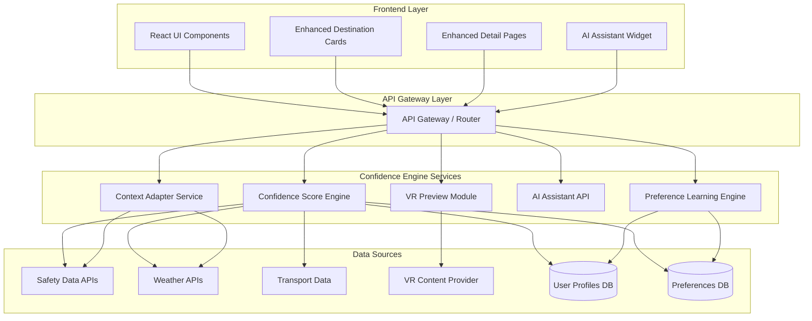

# Design Document: Confidence-Driven Travel Engine

## Overview

The Confidence-Driven Travel Engine is a modular, API-first enhancement layer that augments the existing TravelSphere MVP with intelligent confidence scoring and personalized travel assistance. The system operates as a plug-and-play module that integrates seamlessly with existing destination browsing, booking, itinerary, and chat features without requiring modifications to core functionality.

The architecture follows a microservices-inspired approach with clear separation between the confidence calculation engine, preference learning system, context adaptation layer, and presentation components. All components communicate through well-defined API contracts, enabling independent scaling and graceful degradation when services are unavailable.

Key design principles:
- **Modularity**: Each subsystem operates independently with clear interfaces
- **Performance**: Real-time calculations (< 500ms) for confidence scores
- **Scalability**: Stateless services with horizontal scaling capability
- **Graceful Degradation**: System falls back to MVP functionality if confidence engine is unavailable
- **Non-Invasive Integration**: Enhances existing UI components without modifying their core logic

## Architecture

### High-Level Architecture



### Component Responsibilities

**Frontend Layer:**
- Renders confidence badges and meters on destination cards
- Displays confidence breakdown modals
- Manages AI assistant floating widget
- Handles VR preview embedding
- Maintains existing MVP UI functionality

**API Gateway:**
- Routes requests to appropriate services
- Handles authentication and rate limiting
- Provides fallback responses when services unavailable
- Aggregates responses from multiple services

**Confidence Score Engine:**
- Calculates 0-100 confidence scores using weighted factor algorithm
- Fetches and normalizes data from external APIs
- Caches scores with TTL-based invalidation
- Provides score breakdown explanations

**Context Adapter Service:**
- Monitors real-time external conditions
- Adjusts confidence scores based on current context
- Manages geopolitical alerts and weather warnings
- Updates crowd density and seasonal factors

**Preference Learning Engine:**
- Tracks implicit user behavior (clicks, browsing time)
- Collects explicit feedback (post-trip surveys)
- Updates user preference weights
- Provides personalized factor weights to Score Engine

**AI Assistant API:**
- Provides real-time travel assistance in Trip Mode
- Integrates with translation, emergency, and navigation services
- Maintains conversation context
- Delivers responses within 2-second SLA

**VR Preview Module:**
- Embeds 360° VR content via iframe/API
- Handles WebXR compatibility detection
- Provides video fallback for non-VR content
- Optimizes loading for performance

## Components and Interfaces

### 1. Confidence Score Engine

**Purpose:** Core calculation engine for traveler confidence scores

**Interface:**
```typescript
interface ConfidenceScoreRequest {
  destinationId: string;
  userId: string;
  travelDates: {
    startDate: string; // ISO 8601
    endDate: string;
  };
  userProfile?: TravelerProfile;
}

interface ConfidenceScoreResponse {
  destinationId: string;
  score: number; // 0-100
  badge: 'Low' | 'Moderate' | 'High' | 'Excellent';
  breakdown: FactorBreakdown[];
  explanation: string;
  calculatedAt: string; // ISO 8601
  ttl: number; // seconds
}

interface FactorBreakdown {
  factorName: string;
  score: number; // 0-100
  weight: number; // 0-1
  contribution: number; // weighted score
  explanation: string;
}

// API Endpoint
POST /api/confidence/calculate
Request: ConfidenceScoreRequest
Response: ConfidenceScoreResponse
```

**Algorithm:**
```
ConfidenceScore = Σ(FactorScore_i × Weight_i) for i = 1 to 8

Factors and Default Weights:
1. Safety Index (0.20): Crime data + travel advisories
2. Weather Stability (0.10): Forecast reliability + severe weather risk
3. Transport Accessibility (0.15): Public transport + infrastructure ratings
4. Language Compatibility (0.10): Language match + English prevalence
5. Health & Emergency (0.15): Hospital quality + emergency response
6. Budget Match (0.10): Cost alignment with user budget tier
7. Crowd Density (0.10): Seasonal tourism volume
8. Preference Alignment (0.10): Match with user travel history

Weights are personalized based on user preferences from Preference Learning Engine.
```

### 2. Context Adapter Service

**Purpose:** Real-time adjustment of confidence scores based on external conditions

**Interface:**
```typescript
interface ContextAdjustmentRequest {
  destinationId: string;
  baseScore: number;
  travelDates: {
    startDate: string;
    endDate: string;
  };
  userLocation?: {
    latitude: number;
    longitude: number;
  };
}

interface ContextAdjustmentResponse {
  adjustedScore: number;
  adjustments: ContextAdjustment[];
  alerts: Alert[];
}

interface ContextAdjustment {
  factor: string;
  originalValue: number;
  adjustedValue: number;
  reason: string;
}

interface Alert {
  type: 'geopolitical' | 'weather' | 'health' | 'safety';
  severity: 'low' | 'medium' | 'high' | 'critical';
  message: string;
  source: string;
  issuedAt: string;
}

// API Endpoint
POST /api/confidence/adjust-context
Request: ContextAdjustmentRequest
Response: ContextAdjustmentResponse
```

### 3. Preference Learning Engine

**Purpose:** Learn and adapt to user preferences over time

**Interface:**
```typescript
interface ImplicitSignal {
  userId: string;
  eventType: 'click' | 'view' | 'hover' | 'bookmark';
  destinationId: string;
  duration?: number; // milliseconds
  timestamp: string;
}

interface ExplicitFeedback {
  userId: string;
  tripId: string;
  destinationId: string;
  ratings: {
    overall: number; // 1-5
    safety: number;
    value: number;
    accessibility: number;
    experience: number;
  };
  comments?: string;
  timestamp: string;
}

interface PreferenceWeights {
  userId: string;
  weights: {
    safetyIndex: number;
    weatherStability: number;
    transportAccessibility: number;
    languageCompatibility: number;
    healthEmergency: number;
    budgetMatch: number;
    crowdDensity: number;
  };
  confidence: number; // 0-1, based on data volume
  lastUpdated: string;
}

// API Endpoints
POST /api/preferences/track-implicit
Request: ImplicitSignal
Response: { success: boolean }

POST /api/preferences/submit-feedback
Request: ExplicitFeedback
Response: { success: boolean }

GET /api/preferences/weights/:userId
Response: PreferenceWeights
```

### 4. AI Travel Assistant API

**Purpose:** Real-time travel assistance during active trips

**Interface:**
```typescript
interface AssistantRequest {
  userId: string;
  tripId: string;
  query: string;
  context: {
    currentLocation?: {
      latitude: number;
      longitude: number;
    };
    currentDestination: string;
    language: string;
  };
  conversationId?: string;
}

interface AssistantResponse {
  response: string;
  actions?: AssistantAction[];
  conversationId: string;
  responseTime: number; // milliseconds
}

interface AssistantAction {
  type: 'emergency' | 'translation' | 'navigation' | 'weather' | 'safety';
  data: any;
  displayText: string;
}

interface TripModeStatus {
  userId: string;
  tripId: string;
  isActive: boolean;
  startedAt?: string;
  currentDestination?: string;
}

// API Endpoints
POST /api/assistant/query
Request: AssistantRequest
Response: AssistantResponse

POST /api/assistant/trip-mode
Request: TripModeStatus
Response: { success: boolean }

GET /api/assistant/trip-mode/:userId
Response: TripModeStatus
```

### 5. VR Preview Module

**Purpose:** Embed immersive VR/panoramic content

**Interface:**
```typescript
interface VRContentRequest {
  destinationId: string;
  preferredFormat: 'vr360' | 'panorama' | 'video';
}

interface VRContentResponse {
  destinationId: string;
  available: boolean;
  contentType: 'vr360' | 'panorama' | 'video' | 'none';
  embedUrl?: string;
  embedType: 'iframe' | 'webxr' | 'video';
  thumbnailUrl?: string;
  metadata: {
    resolution: string;
    duration?: number;
    provider: string;
  };
}

// API Endpoint
GET /api/vr/content/:destinationId
Response: VRContentResponse
```

### 6. Frontend UI Components

**Enhanced Destination Card:**
```typescript
interface DestinationCardProps {
  destination: Destination; // Existing type
  confidenceScore?: ConfidenceScoreResponse;
  onConfidenceClick?: () => void;
}

// Component renders existing card with added:
// - Confidence badge overlay
// - Confidence meter bar
// - Click handler for breakdown modal
```

**Confidence Breakdown Modal:**
```typescript
interface ConfidenceModalProps {
  score: ConfidenceScoreResponse;
  onClose: () => void;
}

// Displays:
// - Overall score with visual meter
// - Factor breakdown table
// - AI explanation text
// - Context alerts if any
```

**AI Assistant Widget:**
```typescript
interface AssistantWidgetProps {
  tripMode: TripModeStatus;
  onToggle: () => void;
}

// Floating button that expands to chat interface
// Only visible when tripMode.isActive === true
```

## Data Models

### TravelerProfile

```typescript
interface TravelerProfile {
  userId: string;
  persona: {
    budgetTier: 'budget' | 'mid-range' | 'luxury';
    travelStyle: 'solo' | 'couple' | 'family' | 'group';
    experienceLevel: 'novice' | 'intermediate' | 'experienced';
  };
  preferences: {
    prioritySafety: boolean;
    preferredClimate: 'tropical' | 'temperate' | 'cold' | 'any';
    languagePreferences: string[]; // ISO 639-1 codes
    mobilityRequirements: 'none' | 'moderate' | 'high';
    budgetRange: {
      min: number;
      max: number;
      currency: string;
    };
  };
  travelHistory: {
    tripCount: number;
    visitedDestinations: string[];
    averageRating: number;
  };
  preferenceWeights?: PreferenceWeights;
  createdAt: string;
  updatedAt: string;
}
```

### ConfidenceScoreCache

```typescript
interface ConfidenceScoreCache {
  cacheKey: string; // hash of destinationId + userId + travelDates
  score: ConfidenceScoreResponse;
  createdAt: string;
  expiresAt: string;
  invalidated: boolean;
}

// Cache Strategy:
// - TTL: 6 hours for base scores
// - Invalidate on: context changes, user preference updates
// - Storage: Redis or in-memory cache
```

### PreferenceLearningData

```typescript
interface PreferenceLearningData {
  userId: string;
  implicitSignals: ImplicitSignal[];
  explicitFeedback: ExplicitFeedback[];
  derivedWeights: PreferenceWeights;
  lastProcessedAt: string;
}

// Processing:
// - Batch process implicit signals every 24 hours
// - Immediate processing for explicit feedback
// - Minimum 10 interactions before adjusting weights
```

### ExternalDataCache

```typescript
interface ExternalDataCache {
  dataType: 'safety' | 'weather' | 'transport' | 'health';
  destinationId: string;
  data: any;
  source: string;
  fetchedAt: string;
  expiresAt: string;
}

// Cache TTLs:
// - Safety data: 7 days
// - Weather forecasts: 6 hours
// - Transport ratings: 30 days
// - Health facility data: 30 days
```

## Correctness Properties

*A property is a characteristic or behavior that should hold true across all valid executions of a system—essentially, a formal statement about what the system should do. Properties serve as the bridge between human-readable specifications and machine-verifiable correctness guarantees.*


### Property 1: Confidence Score Range Validity

*For any* destination with valid factor data, the calculated confidence score should be a number between 0 and 100 inclusive.

**Validates: Requirements 1.1**

### Property 2: All Factors Influence Score

*For any* destination, changing any of the eight factor values (safety, weather, transport, language, health, budget, crowd, preferences) should result in a different confidence score, demonstrating that all factors contribute to the calculation.

**Validates: Requirements 1.2, 1.3, 1.4, 1.5, 1.6, 1.7, 1.8, 1.9**

### Property 3: Badge Category Mapping

*For any* confidence score value, the assigned badge category should correctly map to the defined ranges: Low (0-40), Moderate (41-65), High (66-85), Excellent (86-100).

**Validates: Requirements 2.1**

### Property 4: Score Display Consistency

*For any* destination card with a confidence score, the visual meter value should match the numerical score value displayed in the badge.

**Validates: Requirements 2.2**

### Property 5: Breakdown Modal Data Completeness

*For any* confidence score breakdown, the modal should display all eight factor scores, their weights, contributions, and explanations, with the sum of contributions equaling the overall score.

**Validates: Requirements 2.4**

### Property 6: VR Content Embedding

*For any* destination with available VR content, the VR module should return a valid embed URL and specify the correct embed type (iframe, webxr, or video).

**Validates: Requirements 3.1**

### Property 7: VR Fallback Behavior

*For any* destination without VR content, the VR module should provide video content as a fallback with contentType set to 'video'.

**Validates: Requirements 3.2**

### Property 8: VR Button Conditional Display

*For any* destination, the "Explore Before You Book" button should be displayed if and only if VR or video content is available for that destination.

**Validates: Requirements 3.3**

### Property 9: Recommendation Ordering by Confidence

*For any* set of destinations with different confidence scores for a given user profile, the recommendation list should be ordered with higher confidence scores appearing before lower confidence scores.

**Validates: Requirements 4.1**

### Property 10: Confidence Match Percentage Range

*For any* recommended destination, the displayed Confidence_Match_Percentage should be a number between 0 and 100 inclusive.

**Validates: Requirements 4.2**

### Property 11: Persona Attributes Influence Matching

*For any* destination, changing user persona attributes (budget tier, travel style, or experience level) should result in a different Confidence_Match_Percentage, demonstrating persona influence on matching.

**Validates: Requirements 4.3**

### Property 12: Trip Mode Activation Toggle

*For any* user, activating Trip_Mode should make the AI_Travel_Assistant floating button visible, and deactivating Trip_Mode should hide it.

**Validates: Requirements 5.1, 5.7**

### Property 13: Assistant Provides Required Capabilities

*For any* active Trip_Mode session, the AI_Travel_Assistant should be capable of providing responses for all required capability types: emergency contacts, translations, weather alerts, safe zones, and navigation routes.

**Validates: Requirements 5.2, 5.3, 5.4, 5.5, 5.6**

### Property 14: Implicit Signal Tracking

*For any* user browsing action (click, view, hover, bookmark), the Preference_Learning_Engine should record an implicit signal with the correct event type, destination ID, and timestamp.

**Validates: Requirements 6.1**

### Property 15: Explicit Feedback Storage

*For any* post-trip feedback submission, the Preference_Learning_Engine should store the feedback with all rating categories and associate it with the correct user and trip.

**Validates: Requirements 6.2**

### Property 16: Preference Weight Updates

*For any* user with new preference data (implicit or explicit), the Traveler_Profile preference weights should be updated to reflect the new information, with weights remaining in the valid range [0, 1].

**Validates: Requirements 6.3**

### Property 17: Learned Preferences Influence Scores

*For any* user with personalized preference weights, confidence scores calculated with those weights should differ from scores calculated with default weights, demonstrating that learned preferences affect scoring.

**Validates: Requirements 6.4**

### Property 18: Preference Profile Structure Validity

*For any* stored Traveler_Profile, the preference data should conform to the defined schema with all required fields (weights for all factors, confidence level, lastUpdated timestamp).

**Validates: Requirements 6.5**

### Property 19: Context Adjustments Modify Scores

*For any* destination with context factors (booking timing, geopolitical alerts, severe weather, crowd changes, location proximity), applying context adjustments should result in a different confidence score than the base score.

**Validates: Requirements 7.1, 7.2, 7.3, 7.4, 7.5**

### Property 20: Graceful Degradation on Service Failure

*For any* API request when the confidence engine service is unavailable, the system should return a successful response with fallback data or gracefully indicate unavailability without throwing errors that break the UI.

**Validates: Requirements 8.6**

## Error Handling

### Error Categories and Strategies

**1. External API Failures**
- **Scenario**: Safety, weather, transport, or VR content APIs are unavailable
- **Strategy**: 
  - Use cached data if available and not expired
  - Fall back to default/neutral values for missing factors
  - Reduce confidence score by 10 points when using fallback data
  - Log failures for monitoring
  - Display warning indicator to user about limited data

**2. Calculation Timeouts**
- **Scenario**: Confidence score calculation exceeds 500ms timeout
- **Strategy**:
  - Return cached score if available
  - If no cache, return estimated score based on available factors
  - Mark score as "preliminary" in response
  - Complete calculation asynchronously and update cache
  - Log timeout for performance monitoring

**3. Invalid Input Data**
- **Scenario**: Missing required fields, invalid date ranges, malformed user profiles
- **Strategy**:
  - Validate all inputs at API gateway level
  - Return 400 Bad Request with detailed error messages
  - Provide default values for optional fields
  - Log validation failures for debugging

**4. User Profile Not Found**
- **Scenario**: Confidence calculation requested for non-existent user
- **Strategy**:
  - Use anonymous/default profile with standard weights
  - Calculate score without personalization
  - Mark score as "general" rather than "personalized"
  - Suggest user to create profile for better recommendations

**5. VR Content Loading Failures**
- **Scenario**: VR iframe fails to load, WebXR not supported
- **Strategy**:
  - Detect iframe load failures with timeout
  - Fall back to video content automatically
  - If video also fails, display static images
  - Provide clear error message to user
  - Log failures by content provider for monitoring

**6. Preference Learning Data Corruption**
- **Scenario**: Invalid signals, corrupted feedback data
- **Strategy**:
  - Validate all incoming signals against schema
  - Reject invalid data with error response
  - Quarantine corrupted records for manual review
  - Continue using last valid preference weights
  - Alert monitoring system for data quality issues

**7. Context Adapter Service Unavailable**
- **Scenario**: Real-time context adjustments cannot be fetched
- **Strategy**:
  - Use base confidence scores without adjustments
  - Display notice that scores may not reflect latest conditions
  - Retry context fetch in background
  - Cache last known context data for fallback

**8. AI Assistant API Failures**
- **Scenario**: Assistant query times out or returns error
- **Strategy**:
  - Display friendly error message to user
  - Offer retry option
  - Provide static emergency information as fallback
  - Log failures for monitoring
  - Degrade gracefully to basic chat functionality

### Error Response Format

```typescript
interface ErrorResponse {
  error: {
    code: string; // e.g., "CALCULATION_TIMEOUT", "EXTERNAL_API_FAILURE"
    message: string; // User-friendly message
    details?: any; // Technical details for debugging
    fallbackUsed: boolean;
    retryable: boolean;
  };
  fallbackData?: any; // Partial data if available
}
```

### Monitoring and Alerting

- Track error rates by category and service
- Alert when error rate exceeds 5% for any service
- Monitor API response times and alert on degradation
- Track cache hit rates and alert on low performance
- Log all fallback usage for capacity planning

## Testing Strategy

### Dual Testing Approach

The Confidence-Driven Travel Engine requires both unit testing and property-based testing for comprehensive coverage:

**Unit Tests** focus on:
- Specific examples demonstrating correct behavior
- Edge cases (empty user profiles, missing data, boundary values)
- Error conditions and fallback scenarios
- Integration points between components
- UI component rendering with specific props

**Property-Based Tests** focus on:
- Universal properties that hold across all inputs
- Comprehensive input coverage through randomization
- Invariants that must be maintained
- Relationship properties between components
- Round-trip properties for data transformations

Both approaches are complementary and necessary. Unit tests catch concrete bugs and validate specific scenarios, while property tests verify general correctness across the input space.

### Property-Based Testing Configuration

**Library**: fast-check (TypeScript/JavaScript property-based testing library)

**Configuration**:
- Minimum 100 iterations per property test (due to randomization)
- Each property test must reference its design document property
- Tag format: `// Feature: confidence-driven-travel-engine, Property {number}: {property_text}`

**Example Property Test Structure**:

```typescript
import fc from 'fast-check';

describe('Confidence Score Engine Properties', () => {
  test('Property 1: Confidence Score Range Validity', () => {
    // Feature: confidence-driven-travel-engine, Property 1: Confidence Score Range Validity
    
    fc.assert(
      fc.property(
        fc.record({
          destinationId: fc.string(),
          factors: fc.record({
            safety: fc.float({ min: 0, max: 100 }),
            weather: fc.float({ min: 0, max: 100 }),
            transport: fc.float({ min: 0, max: 100 }),
            language: fc.float({ min: 0, max: 100 }),
            health: fc.float({ min: 0, max: 100 }),
            budget: fc.float({ min: 0, max: 100 }),
            crowd: fc.float({ min: 0, max: 100 }),
            preferences: fc.float({ min: 0, max: 100 }),
          }),
        }),
        (input) => {
          const score = calculateConfidenceScore(input);
          expect(score).toBeGreaterThanOrEqual(0);
          expect(score).toBeLessThanOrEqual(100);
        }
      ),
      { numRuns: 100 }
    );
  });
});
```

### Test Coverage Requirements

**Confidence Score Engine**:
- Property tests for all 20 correctness properties
- Unit tests for error handling scenarios
- Unit tests for cache behavior
- Unit tests for external API integration

**Context Adapter**:
- Property tests for context adjustment properties
- Unit tests for alert processing
- Unit tests for geopolitical data integration

**Preference Learning Engine**:
- Property tests for learning cycle properties
- Unit tests for weight calculation algorithms
- Unit tests for data validation
- Unit tests for minimum data thresholds

**AI Travel Assistant**:
- Property tests for trip mode and capability properties
- Unit tests for conversation context management
- Unit tests for emergency response formatting
- Integration tests for external service calls

**VR Preview Module**:
- Property tests for content embedding and fallback
- Unit tests for WebXR detection
- Unit tests for iframe security
- Unit tests for loading error handling

**Frontend Components**:
- Property tests for UI state properties
- Unit tests for component rendering
- Unit tests for user interactions
- Unit tests for responsive behavior

### Integration Testing

- Test complete confidence calculation flow from API request to UI display
- Test preference learning pipeline from signal capture to weight update
- Test trip mode activation and assistant interaction flow
- Test graceful degradation when services are unavailable
- Test VR content loading and fallback chain

### Performance Testing

- Verify confidence calculation completes within 500ms
- Verify assistant responses complete within 2 seconds
- Verify context adjustments complete within 1 second
- Load test API endpoints for concurrent users
- Test cache effectiveness under load

### Accessibility Testing

- Verify confidence badges have appropriate ARIA labels
- Verify modal dialogs are keyboard navigable
- Verify color contrast meets WCAG AA standards
- Verify screen reader compatibility for all new UI elements

## Implementation Notes

### Technology Stack Alignment

- **Frontend**: React 18+ with TypeScript, integrating with existing TravelSphere components
- **State Management**: React Query for confidence score caching and API state
- **HTTP Client**: Axios for all API communication
- **Testing**: Jest + React Testing Library for unit tests, fast-check for property-based tests
- **Styling**: CSS Modules matching existing TravelSphere design system

### API Gateway Implementation

Consider using Express.js or Fastify for the API gateway layer with:
- Rate limiting middleware
- Authentication/authorization middleware
- Request validation using Joi or Zod
- Response caching with Redis
- Circuit breaker pattern for external API calls

### Caching Strategy

- **Redis** for distributed caching across service instances
- **TTL-based expiration** with background refresh for popular destinations
- **Cache warming** for trending destinations
- **Invalidation triggers** on context changes and preference updates

### Scalability Considerations

- **Stateless services** enable horizontal scaling
- **Database read replicas** for preference and profile queries
- **CDN caching** for VR content and static assets
- **Async processing** for preference learning batch jobs
- **Message queue** (e.g., RabbitMQ) for decoupling services

### Security Considerations

- **API authentication** using JWT tokens
- **Rate limiting** per user and per IP
- **Input sanitization** for all user-provided data
- **CORS configuration** for frontend-backend communication
- **Iframe sandboxing** for VR content embedding
- **Data encryption** at rest for user profiles and preferences

### Monitoring and Observability

- **Metrics**: Response times, error rates, cache hit rates, API call volumes
- **Logging**: Structured logging with correlation IDs for request tracing
- **Alerting**: Automated alerts for service degradation and errors
- **Dashboards**: Real-time visibility into system health and performance
- **Distributed tracing**: Track requests across service boundaries

### Deployment Strategy

- **Feature flags** for gradual rollout
- **A/B testing** for confidence score algorithm variations
- **Blue-green deployment** for zero-downtime updates
- **Rollback capability** for quick recovery from issues
- **Canary releases** for high-risk changes
