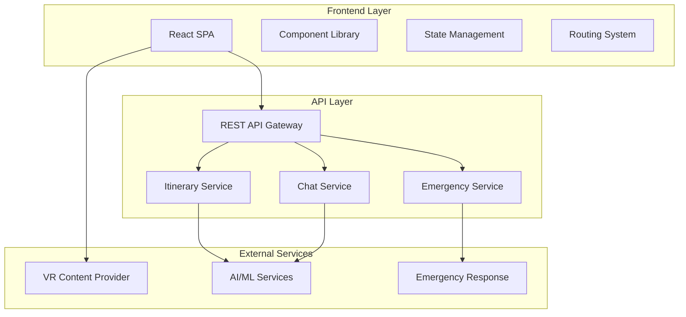

# Design Document

## Overview

TravelSphere is designed as a modern single-page application (SPA) that provides an intelligent travel companion experience. The architecture follows a decoupled frontend-backend pattern with a React-based frontend consuming RESTful APIs. The design emphasizes user experience through intuitive navigation, responsive design, and real-time interactions.

The application serves as an end-to-end travel planning platform that guides users from destination discovery through trip planning to ongoing travel assistance. The design prioritizes visual appeal with travel-themed aesthetics, mobile responsiveness, and seamless user flows.

## Architecture

### High-Level Architecture



### Technology Stack

**Frontend:**
- React 18+ with functional components and hooks
- React Router for client-side routing
- CSS Modules or Styled Components for styling
- Axios for HTTP client communication
- React Query for API state management and caching

**Backend APIs:**
- RESTful API design following OpenAPI 3.0 specification
- JSON request/response format
- HTTP status codes for proper error handling
- CORS enabled for cross-origin requests

**Responsive Design:**
- Mobile-first approach using CSS Grid and Flexbox
- Breakpoints: Mobile (320px+), Tablet (768px+), Desktop (1024px+)
- Touch-friendly interface elements (minimum 44px touch targets)

## Components and Interfaces

### Core Components

#### 1. Destination Discovery Components

**DestinationCard Component:**
```typescript
interface DestinationCardProps {
  id: string;
  name: string;
  description: string;
  imageUrl: string;
  vrPreviewUrl?: string;
  onPlanTrip: (destinationId: string) => void;
  onVRPreview: (vrUrl: string) => void;
}
```

**DestinationGrid Component:**
- Responsive grid layout (1 column mobile, 2-3 columns tablet/desktop)
- Lazy loading for destination images
- Infinite scroll or pagination for large datasets

**VRModal Component:**
- Full-screen modal overlay
- Iframe container for 360-degree content
- Close button and navigation controls
- Loading states for VR content

#### 2. Trip Planning Components

**TripPlannerForm Component:**
```typescript
interface TripPlannerFormData {
  destination: string;
  budget: 'low' | 'medium' | 'luxury';
  startDate: Date;
  endDate: Date;
  interests: Array<'food' | 'adventure' | 'culture' | 'nature' | 'shopping'>;
}
```

**FormField Components:**
- DestinationDropdown: Searchable dropdown with destination options
- BudgetSelector: Radio button group with visual indicators
- DateRangePicker: Calendar-based date selection
- InterestSelector: Multi-select checkbox grid with icons

**LoadingSpinner Component:**
- Animated travel-themed loading indicator
- Progress messages during itinerary generation

#### 3. Itinerary Display Components

**ItineraryTimeline Component:**
```typescript
interface ItineraryDay {
  dayNumber: number;
  date: Date;
  places: Place[];
  foodRecommendations: FoodRecommendation[];
  travelTips: string[];
}

interface Place {
  name: string;
  description: string;
  estimatedTime: string;
  category: string;
}
```

**DayCard Component:**
- Expandable/collapsible day sections
- Visual timeline with connecting lines
- Icon-based categorization for activities

**ActionButtons Component:**
- Primary: "Chat with Travel Assistant"
- Secondary: "Save Trip"
- Consistent styling across the application

#### 4. Chat Interface Components

**ChatContainer Component:**
- Scrollable message history
- Auto-scroll to latest messages
- Message grouping by timestamp

**MessageBubble Component:**
```typescript
interface Message {
  id: string;
  content: string;
  sender: 'user' | 'assistant';
  timestamp: Date;
  type: 'text' | 'suggestion';
}
```

**ChatInput Component:**
- Text input with send button
- Character limit indicator
- Enter key submission support

**QuickSuggestions Component:**
- Predefined question buttons
- Contextual suggestions based on trip data

#### 5. Emergency Support Components

**EmergencyDashboard Component:**
- Large, accessible button layout
- High contrast colors for visibility
- Clear iconography for each emergency type

**EmergencyButton Component:**
```typescript
interface EmergencyButtonProps {
  type: 'medical' | 'passport' | 'hotel' | 'local-help';
  label: string;
  icon: string;
  onPress: (type: string) => void;
}
```

**ConfirmationModal Component:**
- Success message display
- Contact information if applicable
- Return to dashboard option

### Navigation System

**AppRouter Component:**
- React Router implementation
- Route guards for protected areas
- Breadcrumb navigation support

**Navigation Flow:**
```
/ (Home) → /plan-trip → /itinerary/:id → /chat/:tripId
/ (Home) → /emergency-support
```

**Header Component:**
- Logo and branding
- Navigation menu (hamburger on mobile)
- User context indicators

## Data Models

### Frontend Data Models

```typescript
// Destination Model
interface Destination {
  id: string;
  name: string;
  description: string;
  imageUrl: string;
  vrPreviewUrl?: string;
  popularityScore: number;
  category: string[];
}

// Trip Model
interface Trip {
  id: string;
  destination: Destination;
  preferences: TripPreferences;
  itinerary: ItineraryDay[];
  createdAt: Date;
  status: 'planning' | 'active' | 'completed';
}

// Trip Preferences Model
interface TripPreferences {
  budget: BudgetLevel;
  dateRange: {
    startDate: Date;
    endDate: Date;
  };
  interests: Interest[];
  groupSize?: number;
}

// Chat Session Model
interface ChatSession {
  id: string;
  tripId: string;
  messages: Message[];
  isActive: boolean;
  lastActivity: Date;
}

// Emergency Request Model
interface EmergencyRequest {
  id: string;
  type: EmergencyType;
  timestamp: Date;
  status: 'submitted' | 'acknowledged' | 'resolved';
  location?: GeolocationCoordinates;
}
```

### API Response Models

```typescript
// API Response Wrapper
interface ApiResponse<T> {
  success: boolean;
  data?: T;
  error?: {
    code: string;
    message: string;
    details?: any;
  };
  timestamp: Date;
}

// Itinerary Generation Response
interface ItineraryResponse {
  tripId: string;
  itinerary: ItineraryDay[];
  estimatedCost: {
    min: number;
    max: number;
    currency: string;
  };
  generatedAt: Date;
}

// Chat Response
interface ChatResponse {
  messageId: string;
  content: string;
  suggestions?: string[];
  relatedPlaces?: Place[];
  timestamp: Date;
}

// Emergency Response
interface EmergencyResponse {
  requestId: string;
  confirmationMessage: string;
  contactInfo?: {
    phone: string;
    email: string;
  };
  estimatedResponseTime?: string;
}
```

### State Management

**Global State Structure:**
```typescript
interface AppState {
  user: {
    preferences: UserPreferences;
    savedTrips: Trip[];
  };
  currentTrip: Trip | null;
  destinations: Destination[];
  ui: {
    loading: boolean;
    error: string | null;
    activeModal: string | null;
  };
  chat: {
    sessions: ChatSession[];
    activeSession: string | null;
  };
}
```

**State Management Pattern:**
- React Context for global state
- useReducer for complex state updates
- React Query for server state management
- Local storage for persistence of user preferences

## Correctness Properties

*A property is a characteristic or behavior that should hold true across all valid executions of a system—essentially, a formal statement about what the system should do. Properties serve as the bridge between human-readable specifications and machine-verifiable correctness guarantees.*

Based on the prework analysis and property reflection, the following properties validate the core functionality:

**Property 1: Destination Card Content Completeness**
*For any* destination data, when rendered as a destination card, the card should display the destination image, name, short description, and both "Preview in VR" and "Plan My Trip" action buttons.
**Validates: Requirements 1.2, 1.3**

**Property 2: API Endpoint Integration**
*For any* user action that requires backend processing (itinerary generation, chat messages, emergency requests), the system should make POST requests to the correct API endpoints (/api/generate-itinerary, /api/chat-assistant, /api/emergency-support respectively).
**Validates: Requirements 2.6, 4.3, 5.3, 8.1, 8.2, 8.3**

**Property 3: Navigation Flow Consistency**
*For any* navigation action between pages, the system should correctly route to the intended destination and maintain user context throughout the navigation flow.
**Validates: Requirements 1.5, 3.4, 7.1, 7.3**

**Property 4: Itinerary Display Completeness**
*For any* generated itinerary data, when displayed, each day should show day number, date, places to visit, food recommendations, and travel tips.
**Validates: Requirements 3.2**

**Property 5: Chat Message Rendering**
*For any* chat message, the system should render user messages and assistant responses with distinct visual styles based on the sender type.
**Validates: Requirements 4.2**

**Property 6: Loading State Display**
*For any* asynchronous operation (itinerary generation, chat responses), the system should display appropriate loading indicators while the operation is in progress.
**Validates: Requirements 2.7, 4.4**

**Property 7: Data Persistence**
*For any* trip that is saved, the system should store the trip data and make it available for future retrieval.
**Validates: Requirements 3.5**

**Property 8: Responsive Layout Adaptation**
*For any* viewport size change, the system should adapt the layout appropriately to maintain usability across mobile, tablet, and desktop screen sizes.
**Validates: Requirements 6.4**

**Property 9: Error Handling and Fallback**
*For any* API failure or network error, the system should either use mock JSON responses or display appropriate error messages to maintain functionality.
**Validates: Requirements 8.4, 8.5**

**Property 10: Quick Action Triggers**
*For any* quick action button (suggestion buttons, emergency buttons), clicking the button should trigger the appropriate system response (send message, make API call).
**Validates: Requirements 4.6, 5.3**

## Error Handling

### Frontend Error Handling Strategy

**Network Error Handling:**
- Implement retry logic with exponential backoff for failed API requests
- Display user-friendly error messages for network connectivity issues
- Provide offline mode indicators when network is unavailable
- Cache critical data locally to enable offline browsing

**API Error Handling:**
- Handle HTTP status codes appropriately (400, 401, 403, 404, 500)
- Parse and display server-provided error messages
- Implement fallback to mock data when APIs are unavailable
- Log errors for debugging while protecting user privacy

**Form Validation:**
- Client-side validation for immediate feedback
- Server-side validation confirmation
- Clear error messaging for invalid inputs
- Prevent form submission with invalid data

**State Management Errors:**
- Handle state corruption gracefully
- Implement error boundaries to prevent app crashes
- Provide recovery mechanisms for corrupted state
- Clear error states after successful operations

### Error Recovery Patterns

```typescript
// Error Boundary Component
class ErrorBoundary extends React.Component {
  constructor(props) {
    super(props);
    this.state = { hasError: false, error: null };
  }

  static getDerivedStateFromError(error) {
    return { hasError: true, error };
  }

  componentDidCatch(error, errorInfo) {
    console.error('Application error:', error, errorInfo);
  }

  render() {
    if (this.state.hasError) {
      return <ErrorFallback error={this.state.error} />;
    }
    return this.props.children;
  }
}

// API Error Handler
const handleApiError = (error: AxiosError) => {
  if (error.response) {
    // Server responded with error status
    return {
      message: error.response.data?.message || 'Server error occurred',
      status: error.response.status,
      retry: error.response.status >= 500
    };
  } else if (error.request) {
    // Network error
    return {
      message: 'Network connection failed. Please check your internet connection.',
      status: 0,
      retry: true
    };
  } else {
    // Request setup error
    return {
      message: 'An unexpected error occurred',
      status: -1,
      retry: false
    };
  }
};
```

## Testing Strategy

### Dual Testing Approach

The testing strategy employs both unit testing and property-based testing to ensure comprehensive coverage:

**Unit Tests:**
- Focus on specific examples, edge cases, and error conditions
- Test individual component behavior and integration points
- Validate specific user interactions and UI states
- Cover error scenarios and boundary conditions

**Property-Based Tests:**
- Verify universal properties across all inputs using randomized data
- Test system behavior with generated test cases (minimum 100 iterations per property)
- Validate correctness properties defined in the design document
- Each property test references its corresponding design property

### Testing Framework Configuration

**Frontend Testing Stack:**
- Jest as the test runner and assertion library
- React Testing Library for component testing
- MSW (Mock Service Worker) for API mocking
- fast-check for property-based testing implementation

**Property-Based Testing Configuration:**
- Minimum 100 iterations per property test to ensure thorough coverage
- Custom generators for domain-specific data (destinations, trips, messages)
- Shrinking enabled to find minimal failing examples
- Each test tagged with format: **Feature: travel-sphere, Property {number}: {property_text}**

**Test Categories:**

1. **Component Unit Tests:**
   - Individual component rendering and behavior
   - User interaction handling (clicks, form submissions)
   - Props validation and state management
   - Error boundary functionality

2. **Integration Tests:**
   - API integration with mock responses
   - Navigation flow between pages
   - State persistence across components
   - Error handling scenarios

3. **Property-Based Tests:**
   - Each correctness property implemented as a separate test
   - Randomized input generation for comprehensive coverage
   - Universal behavior validation across all valid inputs
   - Regression testing for discovered edge cases

4. **Visual Regression Tests:**
   - Screenshot comparison for UI consistency
   - Responsive layout validation across breakpoints
   - Theme and styling consistency checks

### Test Data Management

**Mock Data Strategy:**
- Realistic destination data with varied content
- Sample itineraries with different trip lengths and preferences
- Chat conversation scenarios with various message types
- Emergency request scenarios for all support types

**Test Environment Setup:**
- Isolated test database for integration tests
- Mock API responses for consistent testing
- Configurable test data generators
- Automated test data cleanup between test runs

### Continuous Testing

**Automated Testing Pipeline:**
- Unit tests run on every commit
- Integration tests run on pull requests
- Property-based tests run nightly with extended iterations
- Visual regression tests run on UI changes

**Performance Testing:**
- Load testing for API endpoints
- Frontend performance monitoring
- Mobile device testing for responsive design
- Accessibility testing for WCAG compliance